# CIFAR10VISIONCLASSIFIER

## Table of Contents
- [Introduction](#introduction)
- [Training](#training)
- [SwiftUI App](#app)
- [SwiftUI App Results](#results)
- [Installation](#installation)
- [Kaggle Submission](#kaggle-submission)

## Introduction
This project was created to participate in the [Kaggle competition](https://www.kaggle.com/c/cifar-10) for the CIFAR-10 dataset. The goal of the competition is to classify images from the dataset. Also a SwiftUI app was created to classify images from the camera or the photo library.

CIFAR-10 is a dataset that consists of several images divided into the following 10 classes:
- Airplanes
- Cars
- Birds
- Cats
- Deer
- Dogs
- Frogs
- Horses
- Ships
- Trucks

The dataset was trained using CreateML and the model was exported to a CoreML model. The model was then used in a SwiftUI app to classify images. This app can be used to classify images from the camera or the photo library.

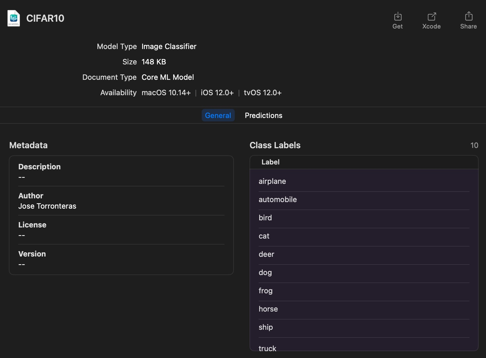

## Training
For the training, the CIFAR-10 dataset was used. The dataset was downloaded from [Kaggle](https://www.kaggle.com/c/cifar-10/data).
Parameters used for training:
- Iterations: 100
- Augmentation: Flip and rotate

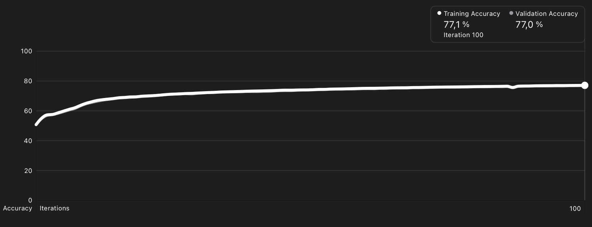
<br>

## SwiftUI App
The app was created using SwiftUI and the CoreML model was used to classify images. The app can be used to classify images from the camera or the photo library.
Minimum iOS version: 15.0.

<br>

## SwiftUI App Results
The app was tested using the following images (pictures taken by me):

Good results:

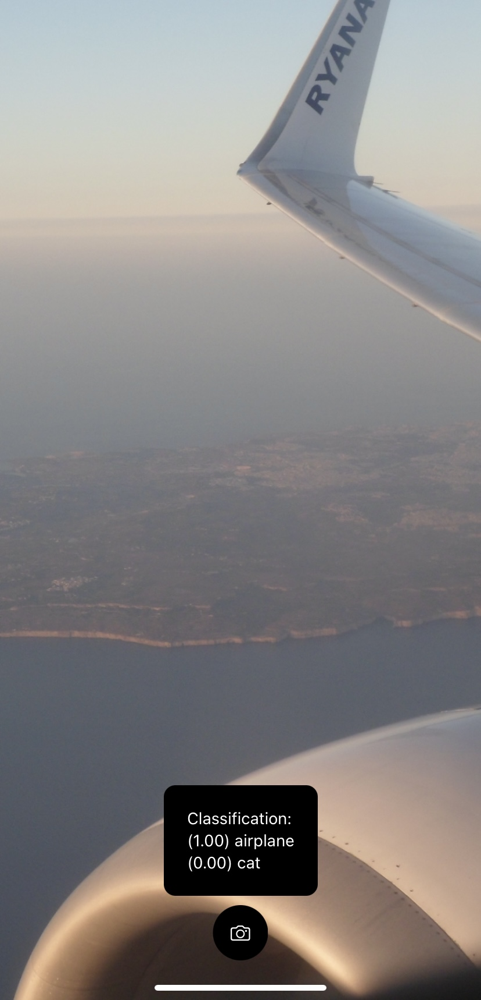
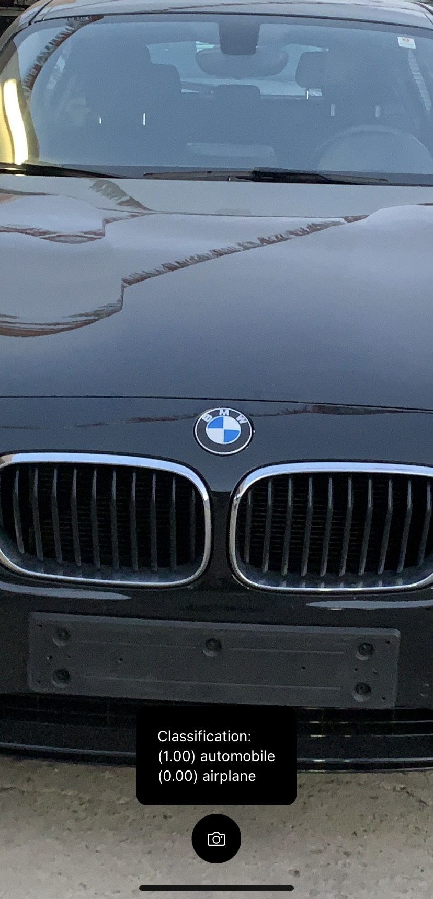
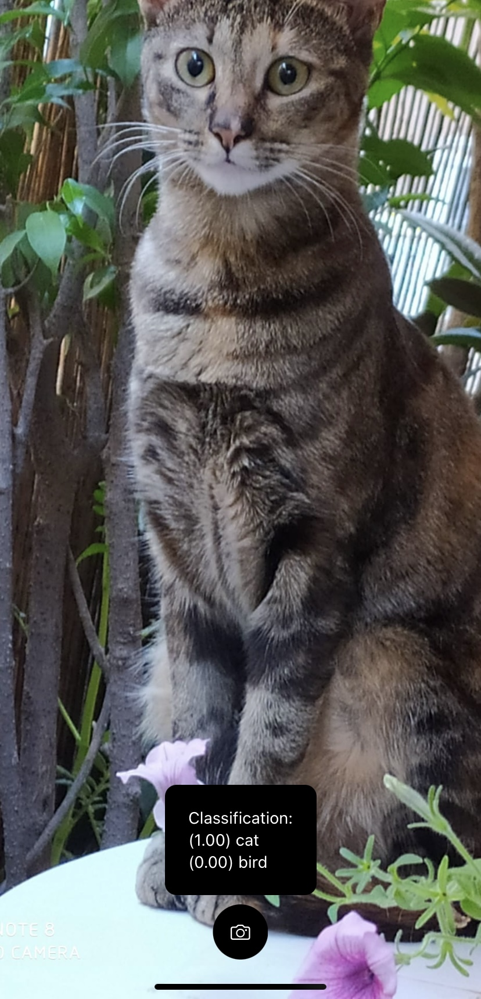

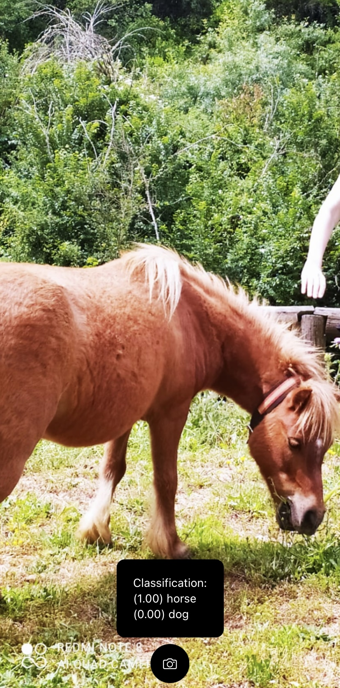
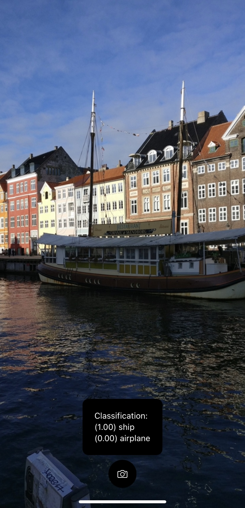

<br>
Bad results:

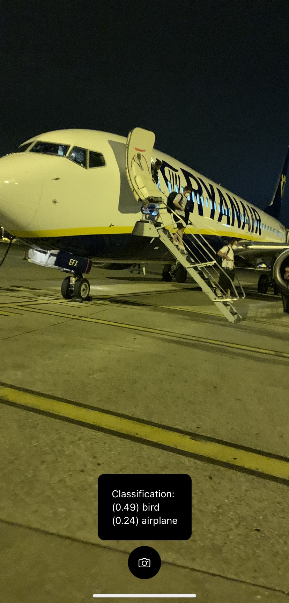
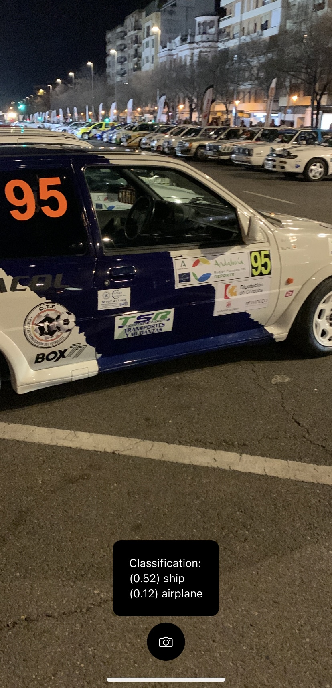
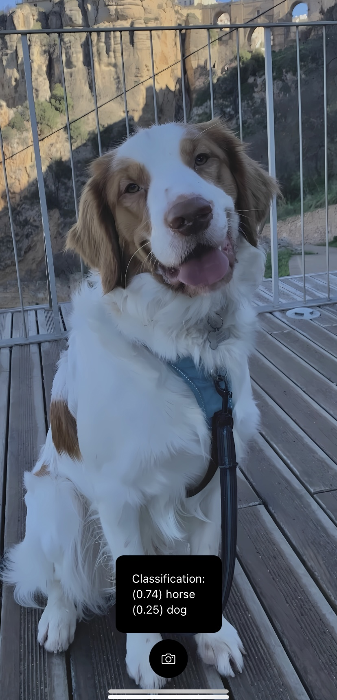
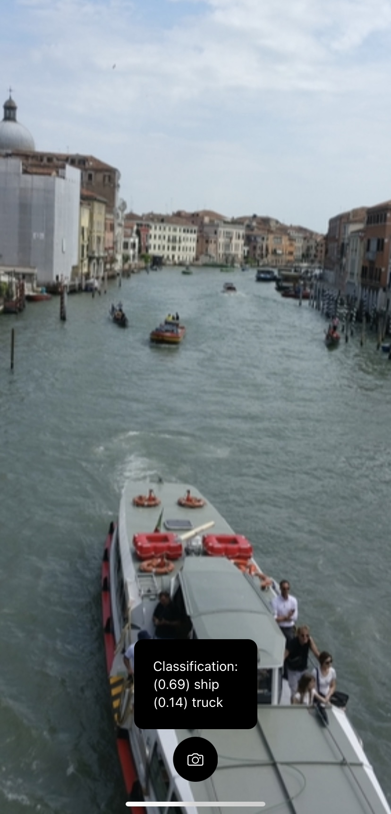

<br>

## Installation
The installation is for testing purposes only.
```bash
python3 -m venv venv
source venv/bin/activate
pip install -r requirements.txt
open CIFAR-10\ -\ Object\ Recognition\ in\ Images.ipynb
```
<br>

## Kaggle Submission
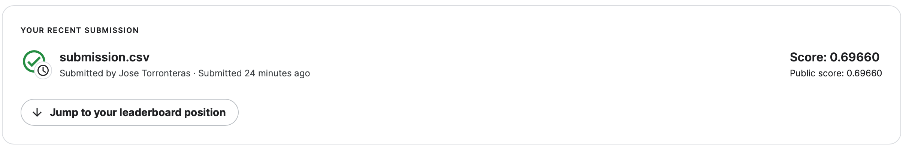
[Kaggle submission](https://www.kaggle.com/c/cifar-10/leaderboard#score) - [Kaggle profile](https://www.kaggle.com/josetorronteras)

<br>

Thanks.